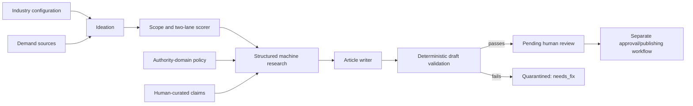

# Architecture

## Purpose

The engine turns reader-demand signals into ranked topics and then into **drafts for human review**. It is a
small, file-based pipeline for expertise brands, not a publishing platform.



## Runtime configuration

`config/engine.json` is the single runtime source of truth for:

- brand, field, reader, professional label, and moat label;
- in-scope and out-of-scope work;
- cluster ids, descriptions, and `practice_value` weights;
- word range and disclaimer;
- moat-detection terms, title examples, already-published topics, and Stack Exchange searches;
- the voice-exemplar file.

`npm run check:customization` is a fail-closed readiness gate. `run.js` and `write.js` also call the gate, so
starter placeholders cannot accidentally produce client-facing work.

## Stage 1: ideation

`src/ideation.js` expands configured seeds through Google Autocomplete, runs configured Stack Exchange
searches, and optionally asks the model for net-new ideas. It normalizes/deduplicates candidates and removes
configured excluded terms/geographies.

AI-generated ideas pass two gates before scoring:

1. deterministic patterns in `config/topic-blocklist.json`;
2. a fail-closed expert-premise audit.

Only AI ideas that survive scoring are added to the proposal ledger. Rejected inventions no longer poison the
deduplication memory.

## Stage 2: scoring

The scorer produces two separate lists:

- **Lane A:** broad/informational. Demand carries the most weight.
- **Lane B:** moat-specific. Differentiation and groundability carry more weight.

External numeric demand signals remain numeric. The model handles qualitative scope, cluster, lane,
differentiation, groundability, and evergreen judgments. Without a key, deterministic heuristics provide a
reduced-capability fallback.

`grounding_authority` values emitted by scoring are hints for later research. They are never evidence.

## Stage 3: research

`src/verify.js` asks the web-search-enabled model for structured claim records:

```json
{
  "id": "deadline",
  "statement": "The filing deadline is 30 days after approval.",
  "scope": "moat",
  "source_url": "https://authority.example/rule",
  "source_title": "Official rule"
}
```

The deterministic normalizer retains a web claim only when:

1. the statement and URL are present;
2. the URL was actually returned by the web-search tool;
3. the hostname matches `general_authority` or `moat_authority` in `config/sources.json`;
4. a moat claim uses the moat tier, not merely a general source.

Human-verified entries in `config/grounding.json` can become `human_curated` claims. Unverified entries and
blank citations do not match.

Research artifacts are cached in `output/briefs.json` only when at least one claim passed. A failed search
does not poison the cache.

## Stage 4: drafting and validation

The writer sees only retained claim ids/statements/scopes, not arbitrary search-page content. It returns a
title/dek/mode, `used_claim_ids`, and article body.

Post-processing enforces the style rules, then deterministic validation checks:

- every returned claim id belongs to the retained direct-claim set;
- hard facts in title, dek, or body also appear in a retained claim statement;
- forbidden dash punctuation did not survive cleanup;
- prose colon use remains under the configured house cap;
- word count fits `config/engine.json`;
- citation-shaped text is covered by the legacy curated-authority validator where applicable.

Detected hard facts include money, percentages, years, durations/deadlines, numbered forms/specifications,
and section/citation shapes. Failure sets `status: "needs_fix"` and writes a `.NEEDS-FIX.md` file.

This is a guardrail, not semantic proof. A human must still confirm that the prose accurately represents the
source claim.

## Output state semantics

New records include these deliberately separate states:

| Field | Meaning on engine output |
|---|---|
| `status` | `drafted` or `needs_fix`; machine pipeline state |
| `machine_researched` | at least one claim passed source policy |
| `research_status` | `completed`, `incomplete`, or `unavailable` |
| `verified` | always `false`; reserved for a human fact-check workflow |
| `review_status` | `pending_human_review` |
| `human_reviewed` | always `false` on new drafts |
| `publishable` | always `false` on new drafts |
| `needs_grounding` | research/support is missing for part or all of the article |

Nothing in this repository flips a draft to publishable or sends it to a CMS.

## Storage and concurrency

Persistent JSON/text writes go through `src/storage.js`, which writes a same-directory temporary file and
renames it into place. Read-modify-write caches use lock files. The writer also holds one process lock for the
draft batch, preventing two runs from silently overwriting each other's `drafts.json`.

## Testing

`npm test` runs offline tests for:

- customization/config relationships;
- source-tier and returned-URL policy;
- supported and invented hard facts;
- claim-id filtering;
- atomic storage and lock cleanup;
- premise blocklist behavior;
- curated-authority/citation guard behavior.

CI runs the offline suite on Node 18, 20, and 22. `npm run test:golden` is the optional live model check.

## Known boundaries

- No guard can prove full semantic equivalence between prose and a source; human review remains mandatory.
- Google Autocomplete is an unofficial endpoint and may throttle or change.
- Web-search research costs money and depends on model/tool availability.
- There is no review UI, CMS integration, analytics loop, authentication, or multi-tenant isolation here.
- Copy-editor model passes can change wording; validators catch known invariants, not every possible meaning
  change.
